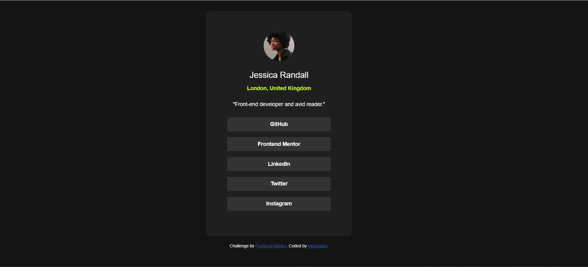

# 💼 Social Links Profile - Frontend Mentor Challenge

A sleek, responsive social profile card built as part of the [Frontend Mentor](https://www.frontendmentor.io) challenge. This project showcases clean HTML and CSS skills while emphasizing layout fundamentals, responsive design, and interactive styling.


---

## 🚀 Live Demo
🔗 [View Project Live](https://mohaniish2208.github.io/Social-Links-Profile/)

---

## 📌 Features

- ✅ Mobile-first responsive design
- ✅ Clean, semantic HTML5 markup
- ✅ Modern CSS styling using Flexbox
- ✅ Custom hover effects for social links
- ✅ Attribution footer pinned to bottom of viewport

---

## 📂 Folder Structure

```bash
├── index.html
├── style.css
├── assets/
│   └── images/
│       └── avatar-jessica.jpeg
│       └── favicon-32x32.png
```
## 📬 Connect With Me 
- ✅ GitHub - https://github.com/Mohaniish2208
- ✅ Frontend Mentor - https://www.frontendmentor.io/profile/Mohaniish2208
